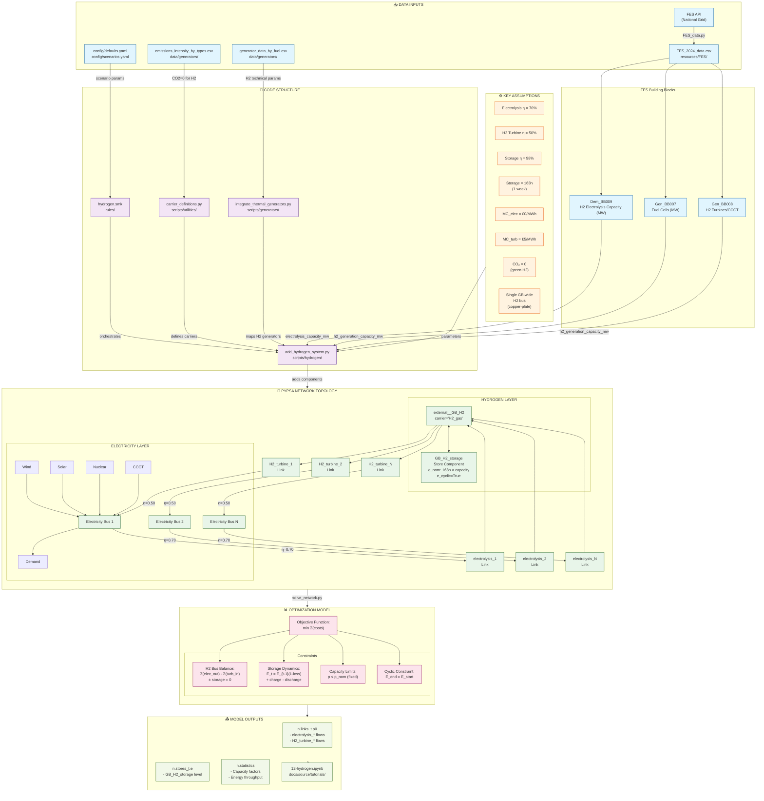

# PyPSA-GB approach

PyPSA-GB uses a **"copper-plate" hydrogen model** with a single GB-wide hydrogen bus. 

| Category                          | Implementation Status   | Granularity Level               |
| --------------------------------- | ----------------------- | ------------------------------- |
| **Electrolysis**                  | ✅ Implemented           | Simplified copper-plate GB-wide |
| **SMR (Steam Methane Reforming)** | ❌ Not implemented       | N/A                             |
| **Fuel Cells**                    | ✅ Partially implemented | Generator type only             |
| **Hydrogen Turbines**             | ✅ Implemented           | GB-wide H2 turbine              |
| **Hydrogen Storage**              | ✅ Implemented           | Single GB-wide store            |
| **Hydrogen Pipelines**            | ❌ Not implemented       | N/A                             |
### Summary of the Modelled Hydrogen System

| Aspect                    | Details                                                                                                                                 |
| ------------------------- | --------------------------------------------------------------------------------------------------------------------------------------- |
| **Primary Script**        | [add_hydrogen_system.py](vscode-webview://09bqo44edvta21m0tp13i6q0sr7r0h3sj8oofq6d1r3vt0bmld6i/scripts/hydrogen/add_hydrogen_system.py) |
| **Data Source**           | FES 2024 Building Blocks (Dem_BB009, Gen_BB007/008)                                                                                     |
| **Network Model**         | Copper-plate (single GB-wide H2 bus)                                                                                                    |
| **Round-trip Efficiency** | 34.3% (70% × 50% × 98%)                                                                                                                 |
| **Storage Duration**      | 168 hours (1 week)                                                                                                                      |
| **Current Limitations**   | No regional H2 network, no blue hydrogen (SMR), no sector coupling                                                                      |
**Key interconnections:**
- 22 electrolysis links connect electricity buses → H2 bus (EE50 scenario)
- 155 H2 turbine links connect H2 bus → electricity buses
- 1 H2 storage provides temporal arbitrage with cyclic constraint
- All H2 carriers defined with `co2_emissions=0` (green hydrogen assumption)
### Hydrogen Modelling Diagram

## Limitations for My Research

## FES Hydrogen Data Provided

| Data Provided                                                                                   | Workbook Location  |
| ----------------------------------------------------------------------------------------------- | ------------------ |
| Hydrogen production volumes by pathway                                                          | F.67, WS1          |
| Hydrogen supply by pathway and technology                                                       | F.69, WS1          |
| Hydrogen demand by pathway and sector (Industrial Sector, Heating, Transport, Power Generation) | ED1, ED7, ED5, WS1 |
| Hydrogen Production: Natural Gas Demand                                                         | ED3                |
| Hydrogen Storage Capacities by pathway                                                          | WS1                |
| Low-Carbon Hydrogen Production Projects By Development Stage - MW of initial targeted capacity  | F.68               |

# PyPSA-Eur Approach

**Hydrogen Technologies:**
- PyPSA-EUR implements a **complete hydrogen supply chain** including production (electrolysis, SMR), storage (underground caverns, steel tanks), transport (pipelines, retrofit options), and end-use (fuel cells, turbines, industry, transport)
- Hydrogen is modeled as a **regional commodity** with explicit spatial resolution at each network node
- The system supports **myopic and perfect foresight** optimization modes
- Waste heat recovery from electrolysis and fuel cells is explicitly modeled

| Category                          | Implementation Status | Granularity Level |
| --------------------------------- | --------------------- | ----------------- |
| **Electrolysis**                  |                       |                   |
| **SMR (Steam Methane Reforming)** |                       |                   |
| **Fuel Cells**                    |                       |                   |
| **Hydrogen Turbines**             |                       |                   |
| **Hydrogen Storage**              |                       |                   |
| **Hydrogen Pipelines**            |                       |                   |
### Summary of the Modelled Hydrogen System

| Aspect                    | Details |
| ------------------------- | ------- |
| **Primary Script(s)**     |         |
| **Data Source(s)**        |         |
| **Key Assumptions**       |         |
| **Network Model**         |         |
| **Round-trip Efficiency** |         |
| **Storage Duration**      |         |
| **Current Limitations**   |         |
**Key interconnections:**

### Hydrogen Modelling Diagram

# describe issue briefly 

# simplifying assumptions choices 

1. Assume all hydrogen converted to power 
2. Assume all hydrogen used to meet zonal hydrogen demand 
3. Other 

## outline impact of simplifying assumptions & potential mitigations
