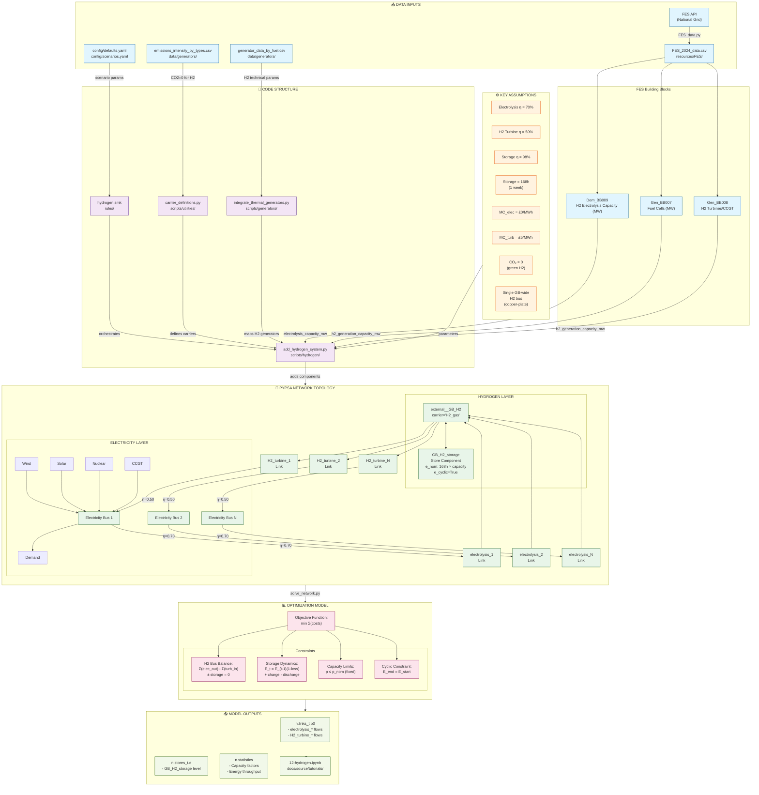

# PyPSA-GB approach

PyPSA-GB uses a **"copper-plate" hydrogen model** with a single GB-wide hydrogen bus. 

| Category                          | Implementation Status   | Granularity Level               |
| --------------------------------- | ----------------------- | ------------------------------- |
| **Electrolysis**                  | ✅ Implemented           | Simplified copper-plate GB-wide |
| **SMR (Steam Methane Reforming)** | ❌ Not implemented       | N/A                             |
| **Fuel Cells**                    | ✅ Partially implemented | Generator type only             |
| **Hydrogen Turbines**             | ✅ Implemented           | GB-wide H2 turbine              |
| **Hydrogen Storage**              | ✅ Implemented           | Single GB-wide store            |
| **Hydrogen Pipelines**            | ❌ Not implemented       | N/A                             |
### Summary of the Modelled Hydrogen System

| Aspect                    | Details                                                                                                                                 |
| ------------------------- | --------------------------------------------------------------------------------------------------------------------------------------- |
| **Primary Script**        | [add_hydrogen_system.py](vscode-webview://09bqo44edvta21m0tp13i6q0sr7r0h3sj8oofq6d1r3vt0bmld6i/scripts/hydrogen/add_hydrogen_system.py) |
| **Data Source**           | FES 2024 Building Blocks (Dem_BB009, Gen_BB007/008)                                                                                     |
| **Network Model**         | Copper-plate (single GB-wide H2 bus)                                                                                                    |
| **Round-trip Efficiency** | 34.3% (70% × 50% × 98%)                                                                                                                 |
| **Storage Duration**      | 168 hours (1 week)                                                                                                                      |
| **Current Limitations**   | No regional H2 network, no blue hydrogen (SMR), no sector coupling                                                                      |
**Key interconnections:**
- 22 electrolysis links connect electricity buses → H2 bus (EE50 scenario)
- 155 H2 turbine links connect H2 bus → electricity buses
- 1 H2 storage provides temporal arbitrage with cyclic constraint
- All H2 carriers defined with `co2_emissions=0` (green hydrogen assumption)
### Hydrogen Modelling Diagram

## Limitations for My Research

## FES Hydrogen Data Provided

| Data Provided                                                                                   | Workbook Location  |
| ----------------------------------------------------------------------------------------------- | ------------------ |
| Hydrogen production volumes by pathway                                                          | F.67, WS1          |
| Hydrogen supply by pathway and technology                                                       | F.69, WS1          |
| Hydrogen demand by pathway and sector (Industrial Sector, Heating, Transport, Power Generation) | ED1, ED7, ED5, WS1 |
| Hydrogen Production: Natural Gas Demand                                                         | ED3                |
| Hydrogen Storage Capacities by pathway                                                          | WS1                |
| Low-Carbon Hydrogen Production Projects By Development Stage - MW of initial targeted capacity  | F.68               |

# PyPSA-Eur Approach

**Hydrogen Technologies:**
- PyPSA-EUR implements a **complete hydrogen supply chain** including production (electrolysis, SMR, SMR-CC), storage (underground caverns, steel tanks), transport (new pipelines, retrofit options), and end-use (fuel cells, turbines, industry, transport, synthetic fuels)
- Hydrogen is modeled as a **regional commodity** with explicit spatial resolution at each network node (H2 bus per node)
- The system supports **myopic and perfect foresight** optimization modes
- Waste heat recovery from electrolysis, fuel cells, and synthesis processes is explicitly modeled
- Units are in MWh_LHV (Lower Heating Value)

### Summary Table of Hydrogen Components Modelled

| Category | Implementation Status | Granularity Level | Key Parameters | Code Reference |
| -------- | --------------------- | ----------------- | -------------- | -------------- |
| **Electrolysis** | ✅ Fully implemented | Regional (per node) | `efficiency`, `capital_cost`, `min_part_load_electrolysis` (default: 0) | `prepare_sector_network.py:1822-1833` |
| **SMR (Steam Methane Reforming)** | ✅ Fully implemented | Regional (per node) | `efficiency`, `capital_cost`, CO₂ emissions to atmosphere | `prepare_sector_network.py:2194-2207` |
| **SMR with Carbon Capture (SMR-CC)** | ✅ Fully implemented | Regional (per node) | `efficiency`, `cc_fraction` (default: 0.9), CO₂ split to atmosphere/sequestration | `prepare_sector_network.py:2176-2192` |
| **Fuel Cells** | ✅ Fully implemented | Regional (per node) | `efficiency`, `capital_cost`, waste heat recovery (default: 100%) | `prepare_sector_network.py:1835-1849` |
| **Hydrogen Turbines** | ✅ Fully implemented | Regional (per node) | OCGT technology costs, `efficiency`, `VOM` | `prepare_sector_network.py:1851-1869` |
| **Underground Storage (Salt Caverns)** | ✅ Fully implemented | Regional (sites >2 TWh) | `e_nom_max` from cavern potentials, `e_cyclic=True`, max 1000 TWh/site | `prepare_sector_network.py:1871-1903` |
| **Overground Storage (Steel Tanks)** | ✅ Fully implemented | Regional (nodes without caverns) | Type 1 tanks with compressor, `e_nom_extendable=True` | `prepare_sector_network.py:1905-1918` |
| **New H2 Pipelines** | ✅ Fully implemented | Inter-regional (based on DC/gas topology) | Bidirectional (`p_min_pu=-1`), `capital_cost` per km | `prepare_sector_network.py:2070-2092` |
| **Retrofitted Gas Pipelines** | ✅ Fully implemented | Inter-regional (existing gas network) | `H2_retrofit_capacity_per_CH4` (default: 0.6), repurposed costs | `prepare_sector_network.py:2047-2068` |
| **Ammonia Synthesis (Haber-Bosch)** | ✅ Fully implemented | Regional (per node) | Electricity + H₂ → NH₃, waste heat recovery | `prepare_sector_network.py:1450-1467` |
| **Ammonia Cracking** | ✅ Fully implemented | Regional (per node) | NH₃ → H₂ reconversion | `prepare_sector_network.py:1469-1481` |
| **Methanation (Sabatier)** | ✅ Fully implemented | Regional (per node) | H₂ + CO₂ → CH₄, waste heat recovery | `prepare_sector_network.py:2132-2149` |
| **Fischer-Tropsch** | ✅ Fully implemented | Regional (per node) | H₂ + CO₂ → synthetic oil, waste heat recovery | `prepare_sector_network.py:4814-4831` |
| **Methanolisation** | ✅ Fully implemented | Regional (per node) | H₂ + CO₂ + electricity → methanol, waste heat recovery | `prepare_sector_network.py:4771-4789` |

### Summary of the Modelled Hydrogen System

| Aspect | Details |
| ------ | ------- |
| **Primary Script(s)** | `scripts/prepare_sector_network.py` (main), `scripts/build_salt_cavern_potentials.py` (storage), `scripts/build_industrial_energy_demand_per_node.py` (demand), `scripts/build_industry_sector_ratios.py` (sector ratios) |
| **Data Source(s)** | Salt cavern potentials: [Caglayan et al. (2020)](https://doi.org/10.1016/j.ijhydene.2019.12.161); Industrial demand: JRC-IDEES database; Production costs: technology-data repository; Transport demand: country-specific datasets |
| **Key Assumptions** | Electrolysis η = technology-specific (~70%); Fuel cell η = technology-specific (~58%); H₂ turbine uses OCGT costs; Salt cavern min threshold = 2 TWh; Pipeline 1.5× haversine distance factor; DRI steel H₂ consumption = 1.7 MWh/t; All pipelines bidirectional |
| **Network Model** | Spatially-resolved regional network with H₂ bus per node; Pipeline topology derived from DC transmission lines and existing gas network; Optional retrofit of CH4 → H₂ pipelines |
| **Round-trip Efficiency** | Electrolysis → Storage → Fuel Cell: ~58% (η_elec × η_storage × η_FC); Electrolysis → Storage → Turbine: ~40% (η_elec × η_storage × η_OCGT) |
| **Storage Duration** | Unconstrained (endogenous optimization); `e_cyclic=True` ensures annual energy balance |
| **Current Limitations** | No explicit compression stations; Pipeline efficiency losses configurable but default to 1.8%/1000km compression; No hydrogen liquefaction for domestic use (only shipping option); Fixed industrial demand profiles |

### Key Interconnections

**Hydrogen-Electricity Integration:**
- Electrolysis links AC electricity buses → H₂ buses (consumption)
- Fuel cells and H₂ turbines link H₂ buses → AC electricity buses (re-electrification)
- Haber-Bosch consumes electricity + H₂ for ammonia synthesis

**Hydrogen-Gas Integration:**
- SMR converts natural gas → H₂ + CO₂ emissions
- SMR-CC adds carbon capture with configurable capture fraction
- Existing gas pipelines can be retrofitted for H₂ transport
- Methanation (Sabatier) converts H₂ + CO₂ → synthetic methane

**Hydrogen-Heat Integration:**
- Electrolysis waste heat to district heating (default: 25% recovery)
- Fuel cell waste heat to district heating (default: 100% recovery)
- Haber-Bosch, methanation, Fischer-Tropsch, methanolisation waste heat recovery

**Hydrogen-Industry Integration:**
- Direct H₂ demand for industry (`H2 for industry` loads)
- DRI steel production (H₂-DRI + EAF pathway)
- Ammonia for fertilizers and chemicals

**Hydrogen-Transport Integration:**
- Fuel cell vehicles create H₂ load with temperature-dependent efficiency
- Shipping H₂ demand with optional liquefaction

**Hydrogen-Synthetic Fuels Integration:**
- Fischer-Tropsch: H₂ → synthetic oil
- Methanolisation: H₂ → methanol
- Methanation: H₂ → synthetic natural gas

### Hydrogen Modelling Diagram

```mermaid
flowchart TB
    subgraph DataInputs["📥 DATA INPUTS"]
        SaltCavern["Salt Cavern Data<br/>(Caglayan et al. 2020)"]
        JRC["JRC-IDEES Database<br/>(Industrial Energy)"]
        TechCosts["Technology Costs<br/>(technology-data repo)"]
        GasNetwork["Existing Gas Network<br/>(clustered)"]
        TransportDemand["Transport Demand Data"]
        Config["config.default.yaml<br/>(sector options)"]
    end

    subgraph BuildScripts["📂 DATA PROCESSING SCRIPTS"]
        direction TB
        BuildCavern["build_salt_cavern_potentials.py<br/>→ h2_cavern_potential.csv"]
        BuildIndustry["build_industrial_energy_demand_per_node.py<br/>→ industrial_demand.csv"]
        BuildRatios["build_industry_sector_ratios.py<br/>→ sector energy intensities"]
        BuildProduction["build_industrial_production_per_country_tomorrow.py<br/>→ DRI fractions"]
        ClusterGas["cluster_gas_network.py<br/>→ clustered gas network"]

        SaltCavern --> BuildCavern
        JRC --> BuildIndustry
        JRC --> BuildRatios
        GasNetwork --> ClusterGas
    end

    subgraph ConfigParams["⚙️ KEY CONFIGURATION PARAMETERS"]
        direction LR
        subgraph Production["Production"]
            HFC["hydrogen_fuel_cell: true"]
            HTurb["hydrogen_turbine: true"]
            SMRopt["SMR: true"]
            SMRcc["SMR_cc: true"]
        end
        subgraph Storage["Storage"]
            Underground["hydrogen_underground_storage: true"]
            Locations["locations: [onshore, nearshore]"]
        end
        subgraph Network["Network"]
            H2Net["H2_network: true"]
            H2Retro["H2_retrofit: false"]
            RetroRatio["H2_retrofit_capacity_per_CH4: 0.6"]
        end
        subgraph WasteHeat["Waste Heat Recovery"]
            ElecWH["use_electrolysis_waste_heat: 0.25"]
            FCWH["use_fuel_cell_waste_heat: 1.0"]
            HBWH["use_haber_bosch_waste_heat: 0.25"]
        end
        subgraph Industry["Industry"]
            DRIFrac["DRI_fraction: 0→1 (2020→2050)"]
            H2DRI["H2_DRI: 1.7 MWh/t"]
        end
    end

    subgraph MainScript["📂 prepare_sector_network.py"]
        direction TB
        AddStorage["add_storage_and_grids()<br/>Lines 1747-2207"]
        AddAmmonia["add_ammonia()<br/>Lines 1392-1496"]
        AddIndustry["add_industry()<br/>Lines 4507-5020"]
        AddTransport["add_land_transport()<br/>Lines 2580-2700"]
        AddWasteHeat["add_waste_heat()<br/>Lines 5415-5541"]

        AddStorage --> AddAmmonia
        AddAmmonia --> AddIndustry
        AddIndustry --> AddTransport
        AddTransport --> AddWasteHeat
    end

    subgraph NetworkTopology["🔌 PyPSA NETWORK COMPONENTS"]
        direction TB

        subgraph ElecLayer["ELECTRICITY LAYER"]
            ACBus["AC Bus (per node)"]
        end

        subgraph H2Layer["HYDROGEN LAYER"]
            H2Bus["H2 Bus (per node)<br/>carrier='H2'<br/>unit='MWh_LHV'"]
            H2Store["H2 Store<br/>(underground/overground)<br/>e_cyclic=True"]
            H2Bus <--> H2Store
        end

        subgraph GasLayer["GAS LAYER"]
            GasBus["Gas Bus"]
        end

        subgraph HeatLayer["HEAT LAYER"]
            HeatBus["Urban Central Heat Bus"]
        end

        subgraph CO2Layer["CO2 LAYER"]
            CO2Atm["CO2 Atmosphere"]
            CO2Seq["CO2 Sequestration"]
        end

        subgraph SynFuels["SYNTHETIC FUELS"]
            NH3Bus["NH3 Bus"]
            MeOHBus["Methanol Bus"]
            OilBus["Oil Bus"]
        end
    end

    subgraph H2Production["⚡ H2 PRODUCTION (Links)"]
        Electrolysis["H2 Electrolysis<br/>AC → H2<br/>η = ~70%"]
        SMR["SMR<br/>Gas → H2 + CO2<br/>η = ~76%"]
        SMRwCC["SMR CC<br/>Gas → H2 + CO2 (split)<br/>cc_fraction = 0.9"]
        AmmoniaCrack["Ammonia Cracker<br/>NH3 → H2"]
    end

    subgraph H2Conversion["🔄 H2 CONVERSION (Links)"]
        FuelCell["H2 Fuel Cell<br/>H2 → AC + Heat<br/>η = ~58%"]
        H2Turbine["H2 Turbine<br/>H2 → AC<br/>η = ~40% (OCGT)"]
        HaberBosch["Haber-Bosch<br/>AC + H2 → NH3 + Heat"]
        Sabatier["Sabatier<br/>H2 + CO2 → CH4 + Heat"]
        FischerTropsch["Fischer-Tropsch<br/>H2 + CO2 → Oil + Heat"]
        Methanolisation["Methanolisation<br/>H2 + CO2 + AC → MeOH + Heat"]
    end

    subgraph H2Network["🔗 H2 NETWORK (Links)"]
        NewPipeline["H2 Pipeline (new)<br/>bidirectional (p_min_pu=-1)<br/>topology: DC + gas"]
        RetroPipeline["H2 Pipeline (retrofitted)<br/>from existing CH4 network<br/>capacity = 0.6 × CH4"]
    end

    subgraph H2Demand["📊 H2 DEMAND (Loads)"]
        IndustryLoad["H2 for Industry<br/>(steel DRI, chemicals)"]
        TransportLoad["Land Transport Fuel Cell<br/>(temperature-dependent η)"]
        ShippingLoad["H2 for Shipping<br/>(optional liquefaction)"]
    end

    %% Data flow connections
    BuildCavern --> AddStorage
    BuildIndustry --> AddIndustry
    BuildRatios --> AddIndustry
    BuildProduction --> AddIndustry
    ClusterGas --> AddStorage
    TechCosts --> MainScript
    TransportDemand --> AddTransport
    Config --> MainScript

    %% Component connections
    ACBus --> Electrolysis --> H2Bus
    GasBus --> SMR --> H2Bus
    SMR --> CO2Atm
    GasBus --> SMRwCC --> H2Bus
    SMRwCC --> CO2Atm
    SMRwCC --> CO2Seq
    NH3Bus --> AmmoniaCrack --> H2Bus

    H2Bus --> FuelCell --> ACBus
    FuelCell -.->|waste heat| HeatBus
    H2Bus --> H2Turbine --> ACBus
    ACBus --> HaberBosch
    H2Bus --> HaberBosch --> NH3Bus
    HaberBosch -.->|waste heat| HeatBus
    H2Bus --> Sabatier --> GasBus
    Sabatier --> CO2Seq
    Sabatier -.->|waste heat| HeatBus
    H2Bus --> FischerTropsch --> OilBus
    FischerTropsch --> CO2Seq
    FischerTropsch -.->|waste heat| HeatBus
    H2Bus --> Methanolisation --> MeOHBus
    ACBus --> Methanolisation
    Methanolisation --> CO2Seq
    Methanolisation -.->|waste heat| HeatBus
    Electrolysis -.->|waste heat| HeatBus

    H2Bus <--> NewPipeline <--> H2Bus
    H2Bus <--> RetroPipeline <--> H2Bus

    H2Bus --> IndustryLoad
    H2Bus --> TransportLoad
    H2Bus --> ShippingLoad

    subgraph Optimization["📊 OPTIMIZATION MODEL"]
        direction TB
        ObjFunc["Objective Function:<br/>min Σ(capital_cost + marginal_cost)"]

        subgraph Constraints["Constraints"]
            H2Balance["H2 Bus Balance:<br/>Σ(production) - Σ(consumption)<br/>± storage ± pipelines = 0"]
            StorageDyn["Storage Dynamics:<br/>E_t = E_{t-1} + charge - discharge"]
            CapLimits["Capacity Limits:<br/>p ≤ p_nom_max (if set)"]
            CyclicStorage["Cyclic Constraint:<br/>E_end = E_start"]
            CavernMax["Cavern Limits:<br/>e_nom ≤ cavern_potential"]
            RetrofitMax["Retrofit Limits:<br/>p_nom ≤ 0.6 × CH4_capacity"]
        end

        ObjFunc --> H2Balance
        ObjFunc --> StorageDyn
        ObjFunc --> CapLimits
        ObjFunc --> CyclicStorage
        ObjFunc --> CavernMax
        ObjFunc --> RetrofitMax
    end

    subgraph Outputs["📤 MODEL OUTPUTS"]
        LinkFlows["n.links_t.p0/p1<br/>- Electrolysis dispatch<br/>- Fuel cell dispatch<br/>- Pipeline flows<br/>- Conversion flows"]
        StoreState["n.stores_t.e<br/>- H2 storage levels<br/>- NH3 storage levels"]
        Capacities["n.links.p_nom_opt<br/>n.stores.e_nom_opt<br/>- Optimal capacities"]
        Statistics["n.statistics()<br/>- Utilization rates<br/>- Energy throughput"]
        PlotH2["plot_hydrogen_network.py<br/>- H2 network visualization"]
    end

    MainScript --> NetworkTopology
    NetworkTopology --> Optimization
    Optimization --> Outputs

    %% Styling
    classDef dataNode fill:#e1f5fe,stroke:#01579b
    classDef scriptNode fill:#f3e5f5,stroke:#4a148c
    classDef configNode fill:#fff3e0,stroke:#e65100
    classDef networkNode fill:#e8f5e9,stroke:#1b5e20
    classDef productionNode fill:#e3f2fd,stroke:#1565c0
    classDef conversionNode fill:#fce4ec,stroke:#c2185b
    classDef demandNode fill:#fff8e1,stroke:#f57f17
    classDef optimNode fill:#f3e5f5,stroke:#7b1fa2
    classDef outputNode fill:#e8f5e9,stroke:#2e7d32

    class SaltCavern,JRC,TechCosts,GasNetwork,TransportDemand,Config dataNode
    class BuildCavern,BuildIndustry,BuildRatios,BuildProduction,ClusterGas,AddStorage,AddAmmonia,AddIndustry,AddTransport,AddWasteHeat scriptNode
    class HFC,HTurb,SMRopt,SMRcc,Underground,Locations,H2Net,H2Retro,RetroRatio,ElecWH,FCWH,HBWH,DRIFrac,H2DRI configNode
    class ACBus,H2Bus,H2Store,GasBus,HeatBus,CO2Atm,CO2Seq,NH3Bus,MeOHBus,OilBus networkNode
    class Electrolysis,SMR,SMRwCC,AmmoniaCrack productionNode
    class FuelCell,H2Turbine,HaberBosch,Sabatier,FischerTropsch,Methanolisation conversionNode
    class IndustryLoad,TransportLoad,ShippingLoad demandNode
    class ObjFunc,H2Balance,StorageDyn,CapLimits,CyclicStorage,CavernMax,RetrofitMax optimNode
    class LinkFlows,StoreState,Capacities,Statistics,PlotH2 outputNode
```

# describe issue briefly 

# simplifying assumptions choices 

1. Assume all hydrogen converted to power 
2. Assume all hydrogen used to meet zonal hydrogen demand 
3. Other 

## outline impact of simplifying assumptions & potential mitigations
